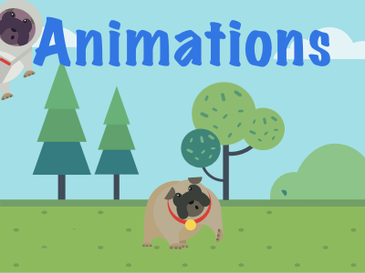
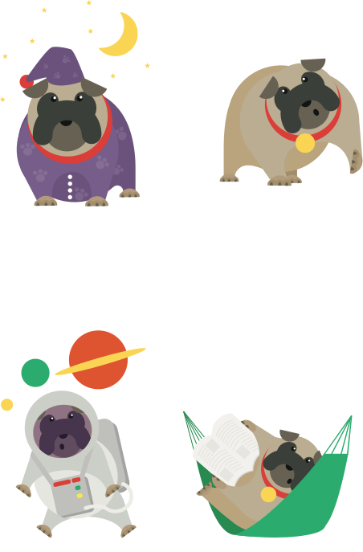
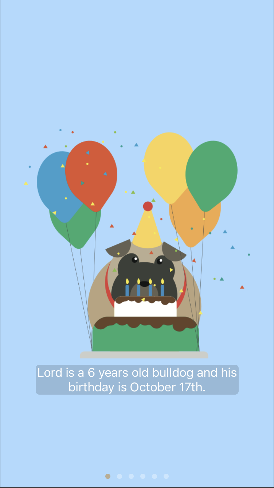
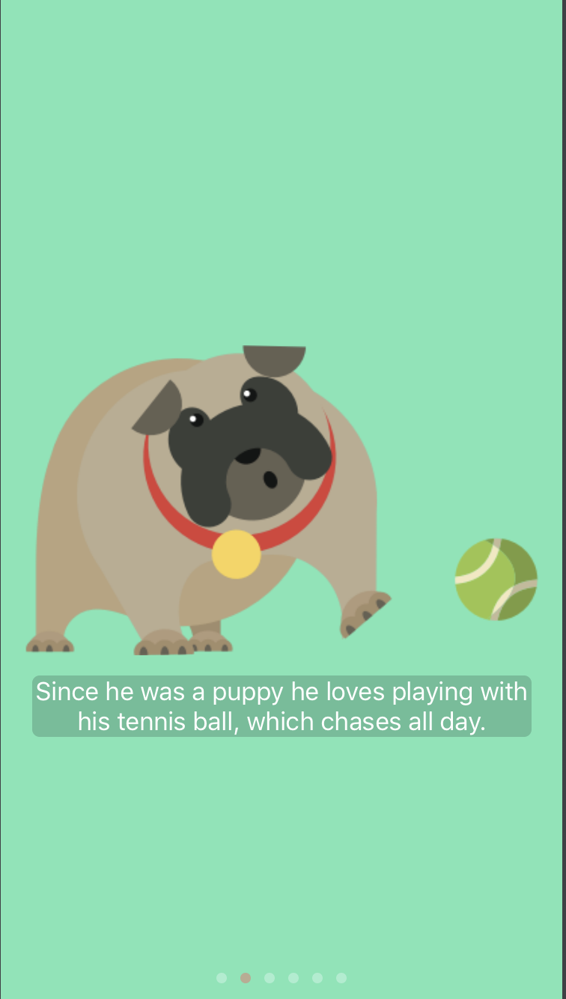
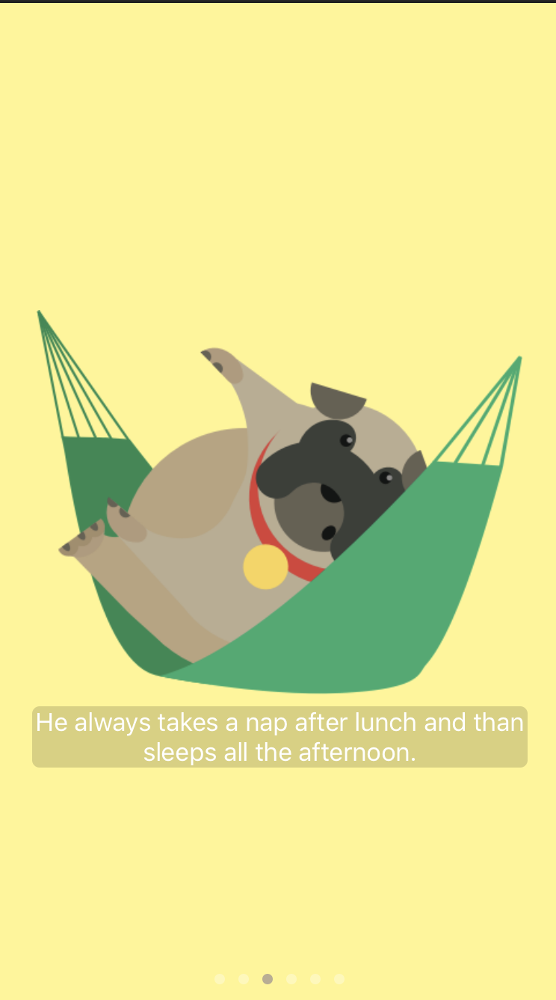

This is the Playground I submitted for WWDC18 scholarship. 

It explains how to do simple animations in UIKit using UIImageViews with alternating frames. You can set some parameters like the duration of the animation.

The main character is my English Bulldog, Lord. Every page is like an adventure with him and it has been tought for children. 

Here are some screenshots: 

  

